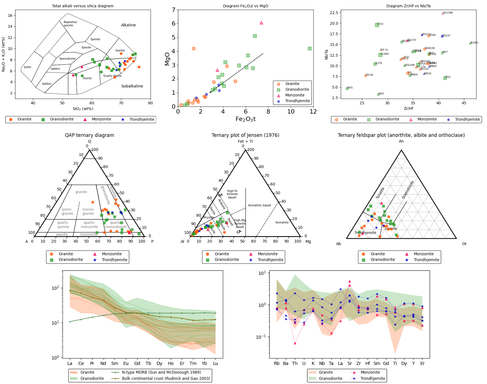

Georunes
----------
[]()

georunes is a bunch of tools and classes written to generate geochemical diagrams using matplotlib. 

It assits the representation of geochemical data in binary diagrams, ternary diagrams and normalized spider diagrams. georunes uses plotting parameters (category, color, marker, label ...) defined in the data source file along with geochemical data to construct the required figures.

## Features

- Data source supported formats: .csv, .xls or .xlsx,
- Data loaded as pandas DataFrames,
- Plotting parameters (color, marker, label, drawing order ...) configurable automatically (see examples/preprocess_files.py),
- Support of axes scaling, layout padding, figure ratio, transparency of markers, sizing of markers, legend configuration, etc.,
- Chemical conversion from wt.% oxide to element (in millications or ppm),
- Ternary diagram (based on the package **python-ternary**),
- Inner geochemical normalization and multiple plotting style in spider diagrams,
- Handling of translation (uses gettext, pass the lang_cfg parameter as a dict{'lang', 'domain' if different, 'locales' if different})...

## Installation

georunes is currently only available on github:

    $ git clone https://github.com/dugucrypter/georunes.git

This code is written in **Python 3.6**, and depends on **matplotlib 3.3**, **pandas 1.1.5** and **scipy 1.1**.

## Working with georunes

### Short example

```python
import matplotlib.pyplot as plt
from georunes.plot.binary.versus import DiagramVs

# Initialize diagram class
diag_nb_ta = DiagramVs(datasource="path/to/data.xls", sheet="sheet1",
                       group_name='Category',  # Attribute used for categorization
                       xvar="Nb", yvar="Ta",  # Variables to plot
                       xlabel="Nb (ppm)", ylabel="Ta (ppm)",  # Labels to write in axes
                       xscale='log', yscale='log',  # Custom scaling
                       )

# Plot data
diag_nb_ta.plot()

# Show the figure
plt.show()
```

More examples with an arbitrary geochemical dataset are proposed in the \examples directory.



## Roadmap

Supplementary whole-rocks and mineral-based geochemical diagrams will be added in the following versions. Long-term updates might provide utilities for geochemical modelling and normative mineralogy.

### Author

W.M.-E. Bonzi, 2021.

### License

This work is under MIT License.