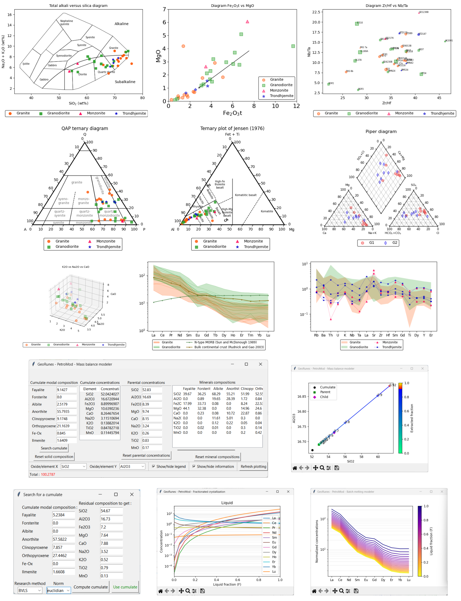

GeoRunes
----------
[]()
[](https://pypi.org/project/georunes/)

GeoRunes is a collection of tools and classes designed for creating geochemical diagrams with matplotlib, calculating normative geochemistry, and performing geochemical modeling.
 
**georunes.plot** assists the representation of geochemical data in binary diagrams, ternary diagrams and normalized spider diagrams. It leverages plotting parameters (category, color, marker, label, etc.) defined in the data source file alongside geochemical data to create customized figures.

**georunes.modmin** estimates the modal mineralogy of whole rock compositions, given a list of minerals and their compositions. It supports various optimization algorithms (e.g., least squares, gradient descent, random search) to estimate mineral modes from whole-rock and mineral compositions.

**georunes.petromod** provides petrological modeling tools including mass balance calculations, batch crystallization/melting and Rayleigh crystallization.

## Features

### Data input and configuration
- Supports data source formats: .csv, .xls or .xlsx.
- Automatically configures plotting parameters (color, marker, label, drawing order, etc.) from data source files (see examples/preprocess_files.py).
- Supports internationalization via gettext (pass lang_cfg as a dictionary: {'lang', 'domain' (optional), 'locales' (optional)}).

### Plotting and visualization
- Supports axis scaling, layout padding, figure aspect ratio adjustments, marker transparency, marker size and legend configuration.
- Includes ternary diagrams based on the **python-ternary** package.
- Implements geochemical normalization and supports multiple plotting styles in spider diagrams.

### Geochemical data processing, modal mineralogy and modeling
- Converts chemical data from weight-percent oxides to elemental concentrations (in milligrams or parts per million).
- Calculates Atoms Per Formula Unit (APFU) from mineral geochemical data.
- Calculates CIPW norm and estimates modal mineralogy through optimization methods.
- Offers several modal mineralogy estimation methods: bounded-variable least squares (BVLS), non-negative least squares (NNLS), gradient descent, and random search (stochastic search).
- Performs mass balance calculations (in magmatic context), including computation of a cumulate modal composition derived from a parental melt.
- Performs batch and Rayleigh fractionation modeling based on provided partition coefficients (Kds), with visualization of concentration vs liquid proportion, or normalized spider diagrams.

## Dependencies

- matplotlib
- pandas
- numpy
- scipy
- python-ternary
- XlsxWriter

## Installation

* Install stable version with pip command:

        pip install georunes

* Install the latest development version from:

        git clone https://github.com/dugucrypter/georunes.git
        cd georunes
        python setup.py install --user

This version of the package code has been tested with **Python 3.11.7**, **matplotlib 3.8.4**, **pandas 2.2.1**, **numpy 1.26.4**, and **scipy 1.13.0**.

## Working with GeoRunes

### Short example

```python
import matplotlib.pyplot as plt
from georunes.plot.binary.versus import DiagramVs

# Initialize the diagram with data and parameters
diag_nb_ta = DiagramVs(
    datasource="path/to/data.xls",  # Path to the data file
    sheet="sheet1",                 # Excel sheet name
    group_name='Category',          # Column name for grouping/categorization
    xvar="Nb",                     # X-axis variable
    yvar="Ta",                     # Y-axis variable
    xlabel="Nb (ppm)",             # X-axis label
    ylabel="Ta (ppm)",             # Y-axis label
    xscale='log',                  # Scale for X-axis (logarithmic)
    yscale='log'                   # Scale for Y-axis (logarithmic)
)

# Generate the plot
diag_nb_ta.plot()

# Display the figure
plt.show()
```

More examples can be found in the ./examples directory.



### Author

W.M.-E. Bonzi, 2021-2025.

### License

This work is under MIT License.